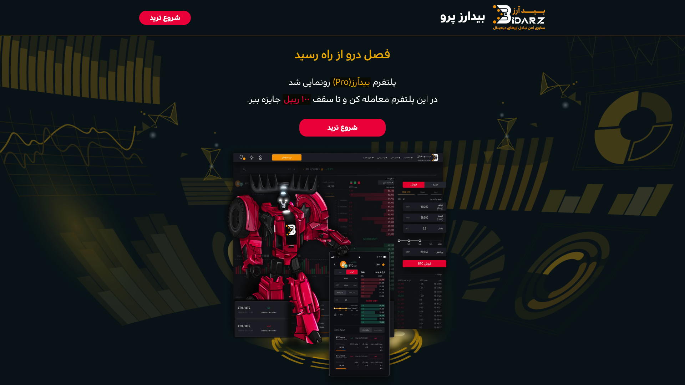

# Bid Arz Pro Landing - HTML + CSS + JavaScript

Bidarz is Iran's first peer-to-peer (P2P) cryptocurrency exchange. It was founded in 2017 and has since grown to become one of the largest cryptocurrency exchanges in the country. Bidarz currently has over 200,000 customers and has generated over $50 million in revenue.

